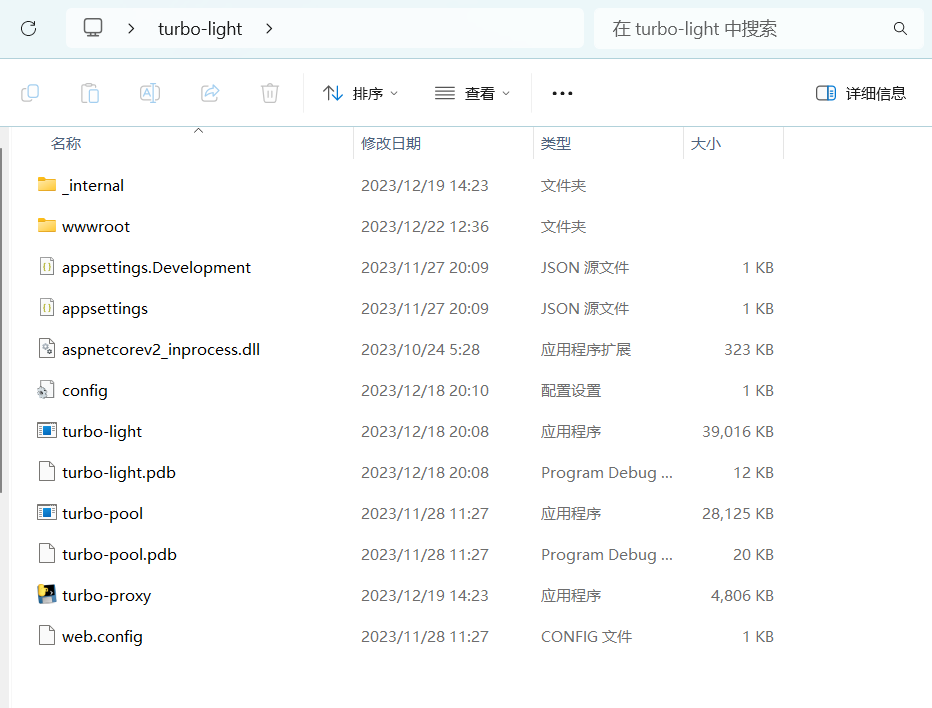

效果

相关项目：  
静态文件服务器 和 桌面UI
https://github.com/Basicconstruction/turbo
# 绝对依赖
后端解析服务器 https://github.com/Basicconstruction/turbo-proxy
release有打包好的exe  
也可以直接使用python main.py 启动后端服务器


使用方式  
## 小白级别
下载最大的UI.rar ， all in one 
目录结构是
  
turbo-server 包含了,子托管的前端服务器turbo-pool，后端解析服务器
turbo-proxy

打开turbo

启动两个服务，（可以更改端口），
启动成功会打开两个命令行，turbo两个栏目的id后面对应
进程id
然后在浏览器中访问即可
## 无依赖最小方式
下载default.rar 中间大小
也就是all in one的turbo-server文件夹

直接启动两个服务  
turbo-proxy可以接受一个可选的端口参数  
参数形式如下，默认端口是8888
```bash
turbo-proxy --port=8888
```
turbo-pool是一个子托管的web服务器，wwwroot中就是前端编译代码 


程序默认托管当前目录的wwwroot，也可以通过指定路径来托管
```bash
turbo-pool 8887 "C://hello//wwwroot"
```
参数是可选的，  
默认值端口是8887，和当前路径下的wwwroot，提供顺序是端口，路径
如果需要更改路径，你也需要提供端口，因为假定第一个参数是端口，第2个参数是路径


## mini后端，前端
### 后端
git clone https://github.com/Basicconstruction/turbo-proxy
安装依赖,执行main.py即可
```python
python install -r requirements.txt

python main.py
```
### 前端
下载解压 browser.rar 仅包含编译的前端代码
直接编译部署到nginx或者iis等服务器软件上
参考
https://angular.cn/guide/deployment

# TurboUI

This project was generated with [Angular CLI](https://github.com/angular/angular-cli) version 17.0.3.

## Development server

Run `ng serve` for a dev server. Navigate to `http://localhost:4200/`. The application will automatically reload if you change any of the source files.

## Code scaffolding

Run `ng generate component component-name` to generate a new component. You can also use `ng generate directive|pipe|service|class|guard|interface|enum|module`.

## Build

Run `ng build` to build the project. The build artifacts will be stored in the `dist/` directory.

## Running unit tests

Run `ng test` to execute the unit tests via [Karma](https://karma-runner.github.io).

## Running end-to-end tests

Run `ng e2e` to execute the end-to-end tests via a platform of your choice. To use this command, you need to first add a package that implements end-to-end testing capabilities.

## Further help

To get more help on the Angular CLI use `ng help` or go check out the [Angular CLI Overview and Command Reference](https://angular.io/cli) page.
