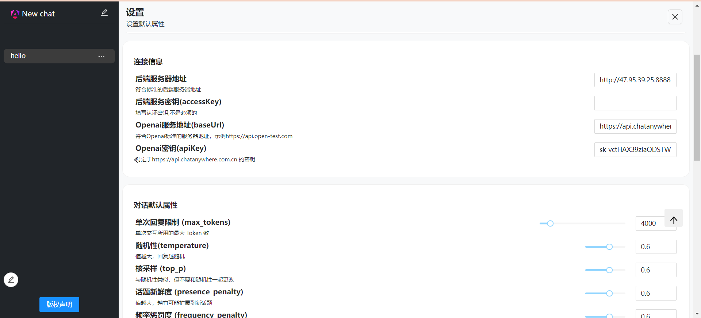
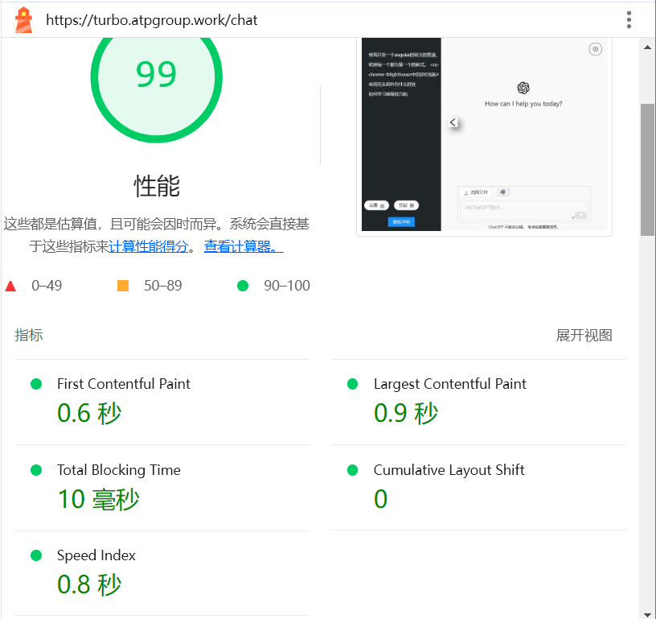

在csdn上阅读使用介绍和简要的设计目的  
http://t.csdnimg.cn/6P2FF  
预览或者体验：  
http:  
前端地址  
nginx http://47.95.39.25/chat  
turbo-pool(.net) http://47.95.39.25:10000/chat    
后端地址  
python http://47.95.39.25:8888  

https:  
前端地址  
iis https://info.atpgroup.work  
后端地址  
iis with python https://translator.atpgroup.work  

注意要修改后端地址为当前服务器地址并且填写自己的密钥和地址

效果
gpt3.5 gpt4

tts 文字转语音

stt 语音转文字

同时还支持gpt4vision(识别图片)(经过基本的测试)
 
支持gpt-3,gpt-4,gpt-4v,dall-3(不支持dall-2),tts,stt(speech to text)  
可以在自己windows上运行，部署在服务器上时，所有设备均可以在浏览器中使用，但是
没有适配移动端。  
源码可以运行在电脑平台，不过需要 进行各自的平台编译。  
源码支持 windows，macos，linux
相关项目：  
静态文件服务器 和 桌面UI
https://github.com/Basicconstruction/turbo
# 绝对依赖
后端解析服务器 https://github.com/Basicconstruction/turbo-proxy
release有打包好的exe  
也可以直接使用python main.py 启动后端服务器


使用方式  
## 小白级别
下载最大的all in one, release中的最大的压缩包
目录结构是
  
turbo-server 包含了,子托管的前端服务器turbo-pool，后端解析服务器
turbo-proxy

打开turbo

启动两个服务，（可以更改端口），
启动成功会打开两个命令行，turbo两个栏目的id后面对应
进程id
然后在浏览器中访问即可

如果使用turbo本机部署，注意如果端口被占用，可以更改端口
，但是注意也要修改网页中的后端地址，图中为8888，对应上图中的8888端口


## 无依赖最小方式
下载release中间大小的压缩包
也就是all in one的turbo-server文件夹

直接启动两个服务  
turbo-proxy可以接受一个可选的端口参数  
参数形式如下，默认端口是8888
```bash
turbo-proxy --port=8888
```
turbo-pool是一个子托管的web服务器，wwwroot中就是前端编译代码 


程序默认托管当前目录的wwwroot，也可以通过指定路径来托管
```bash
turbo-pool 8887 "C://hello//wwwroot"
```
参数是可选的，  
默认值端口是8887，和当前路径下的wwwroot，提供顺序是端口，路径
如果需要更改路径，你也需要提供端口，因为假定第一个参数是端口，第2个参数是路径


## mini后端，前端
### 后端
git clone https://github.com/Basicconstruction/turbo-proxy  
安装依赖,执行main.py即可
```python
python install -r requirements.txt

python main.py
```
### 前端
下载解压 browser.rar 仅包含编译的前端代码
直接编译部署到nginx或者iis等服务器软件上
参考  
https://angular.cn/guide/deployment

