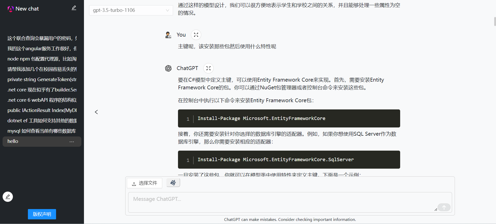
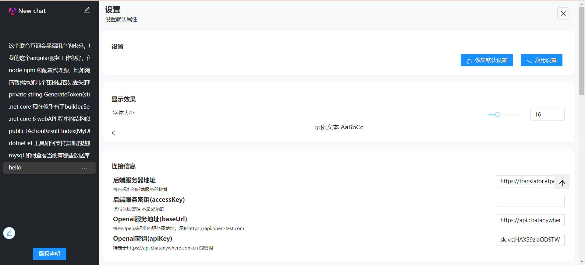
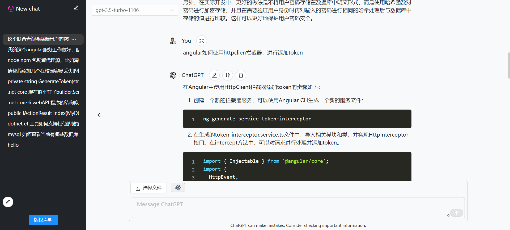
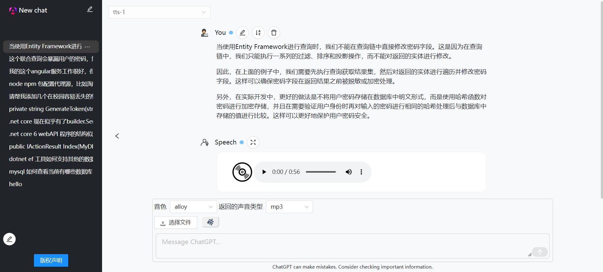
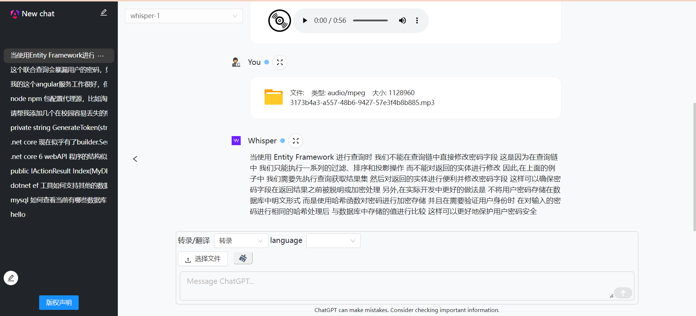

### 在csdn阅读
使用介绍和简要的设计目的  
http://t.csdnimg.cn/6P2FF  
### 预览或者体验：  

https:  
前端地址  
.net with iis(full pwa) https://turbo.atpgroup.work  
后端地址  
 
iis with python https://pp.atpgroup.work

### 展示效果


注意要修改后端地址为当前服务器地址并且填写自己的密钥和地址

效果
gpt3.5 gpt4

tts 文字转语音

stt 语音转文字

gpt4vision


dall-e-3


 
支持gpt-3,gpt-4,gpt-4v,dall-3(不支持dall-2),tts,stt(speech to text)  
上下文：  
gpt3,gpt4,共享上下文,不使用gpt4v的上下文  
gpt4v 使用gpt3,gpt4,gpt4v的上下文  
dall-e,tts,stt 不使用上下文  

目标人群：  
高级用户，会自己编写需要的prompt。  

未来计划：  
及时地支持最新的openai的新的api接口。
使用gpt3，gpt4 的二次处理来支持更高级的任务，比如  
阅读分析 pdf，html，csv，xlsx，word，txt，代码等。  
集合一些比较有趣的功能，通过附件的方式安装到服务器软件，客户端通过
下载服务端支持的“语言”，进行扩展客户端的表现效果。  
比如：  
制作二维码，进行图片检测等与api无关的功能。
新前端： 通过前端来管理后端的功能  

可以在自己windows上运行，部署在服务器上时，所有设备均可以在浏览器中使用，但是
没有适配移动端。  
源码可以运行在电脑平台，不过需要 进行各自的平台编译。  
源码支持 windows，macos，linux
相关项目：  
静态文件服务器 和 桌面UI
https://github.com/Basicconstruction/turbo
# 绝对依赖
后端解析服务器 https://github.com/Basicconstruction/turbo-proxy
release有打包好的exe  
也可以直接使用python main.py 启动后端服务器


使用方式  
## 小白级别
下载最大的turbo-light.rar  
目录结构是

turbo-light 文件夹包含了,子托管的前端服务器turbo-pool，后端解析服务器
turbo-proxy。  
直接启动turbo-light即可。  

还可以通过修改 config.ini来进行细粒度的控制。  
其中前两个分别是 turbo_pool.exe, turbo_proxy的启动端口，
会在 0.0.0.0 上监听端口，这意味着可以在路由器局域网内的设备
甚至公网的设备均可以访问。  
后两个分别指示的是是否启动对应的exe，这两个可以全部在本地启动，
如果你有云服务器，只使用 turbo-proxy 也是可以的。  
tips: 如果需要进行文件上传，图片生成，会占用大量带宽，放置turbo-proxy
在服务器端会浪费大量的 数据传递的时间。  
```json
{
  "pool_port": 8887,
  "proxy_port": 8888,
  "pool_start": true,
  "proxy_start": true
}
```

### 细粒度控制
turbo-proxy可以接受一个可选的端口参数  
参数形式如下，默认端口是8888
```bash
turbo-proxy --port=8888
```
turbo-pool是一个子托管的web服务器，wwwroot中就是前端编译代码 


程序默认托管当前目录的wwwroot，也可以通过指定路径来托管
```bash
turbo-pool 8887 "C://hello//wwwroot"
```
参数是可选的，  
默认值端口是8887，和当前路径下的wwwroot，提供顺序是端口，路径
如果需要更改路径，你也需要提供端口，因为假定第一个参数是端口，第2个参数是路径


## mini后端，前端
### 后端
git clone https://github.com/Basicconstruction/turbo-proxy  
安装依赖,执行main.py即可
```python
python install -r requirements.txt

python main.py
```
### 前端
下载解压 browser.rar / wwwroot.rar 仅包含编译的前端代码
直接编译部署到nginx或者iis等服务器软件上
参考  
https://angular.cn/guide/deployment  
chrome 性能测试  
v2.01
桌面设备：  

移动设备: 

